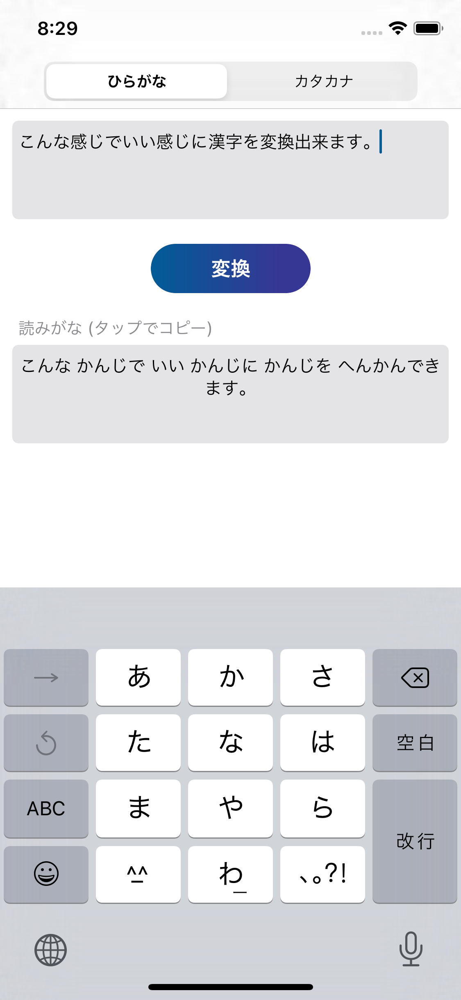
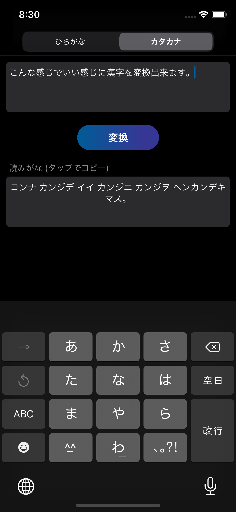

# YUMEMIwork

## レビュアーの方々へ
**iOS アプリ開発の経験がとても浅いため，稚拙な部分が多々あるかと存じますが，何卒ご精査のほど宜しくお願いします．**

現在，卒業研究発表，学会発表の準備で忙しく，100%時間を割くことができませんでした．クオリティを上げきれなかったことをお詫び申し上げます．

現在 ver. 1.0 ですが，研究の合間を縫って期限までは改善を続けようと思います．

## 基本的な機能
- 入力された日本語テキストを全てひらがな・カタカナに変換する．
  - 変換には goo が提供する[ひらがな化API](https://labs.goo.ne.jp/api/jp/hiragana-translation/)を使用．

## スクリーンショット

## 自分なりに追加した機能
- 出力の UITextView をタップすることで出力されたテキストをクリップボードにコピーする
- SegmentedControl を用いたひらがな・カタカナ選択機能
- 以下の場合に適切なアニメーションを表示する
  - 変換している時
  - コピーした時
  - 変換できなかった・通信に失敗した時
- Dark Mode への対応

## UI/UX に関して
- UXに配慮して，ごちゃごちゃせず必要最低限な機能のみを実装した．
- シンプルで上から下へと操作が自然に流れる UI を意識した．
- ポイント色には私のブログ([AstroNOTE!](https://daichidaiji.com))と同様のグラデーションを採用．
- Dark Mode, Light Mode 両方に対応．

## 改善点
- エラーハンドリング
  - 現状，API通信に関して，結果を取得できたかそうでないかだけを判断しています．そこにエラーレスポンスも判断するようにしてユーザーに対して問題点を教えてあげるようにしたいです．
- 債務の明確な切り分け
  - 勉強不足で Delegate などの理解が足りていないので債務の切り分けが全くできていないと感じます．
- テストの不足
  - テストコードの作成方法への理解が足りず，テストを行っていません．

## 今後追加したい機能
- 履歴の表示
  - データベースを用いて変換履歴を表示したいと思っています．
  - 今考えているのはハーフモーダルでの表示です．
  - 自分の実力で間に合えば実装したいです．
- 履歴のお気に入り機能
- 画像認識を用いた入力
  - カメラで読み取った日本語をひらがな・カタカナに変換する機能を実装したいです．
- Localization

## 実装への流れ
私がどういうルートで実装したかを記します．判断材料になれば幸いです．
### 2/3 (Mon) : 設計とSwiftの勉強
- 詳細な課題内容を頂いた．
- Scrapbox で以下のような設計思想をまとめた．
  - 基本機能
  - 自分なりに実装したい機能
  - 評価ポイント
- 必要な基礎知識の勉強
  - 基本文法
  - APIとは
  - XCode11の使い方
- [Hacking with Swift](https://www.hackingwithswift.com/)のチュートリアルで Swift UI による簡単なアプリを作成
  - ブランチの切り方などがとても雑ですが，一応[リポジトリ](https://github.com/daichikuwa0618/SwiftTraining)残してあります．

### 2/4 (Tue) : Gitリポジトリの作成, チームコーディング・API周りの勉強
- 本リポジトリを作成し，gitignoreを編集した．
- 将来チームで実装することを考慮し，Gitブランチモデルの体系化が必要と判断．
  - Gitブランチモデルは[こちら](https://qiita.com/okuderap/items/0b57830d2f56d1d51692)で学びました．
- 設計パターンも知らなかったため，設計パターンをいくつかざっと調べ，今回はMVCで十分と判断．
- 次に，本アプリのメイン機能に必要なAPIの扱い方を学んだ．
- API通信用モデルを作成．

### 2/5 (Wed) : 基本機能の実装, UI設計
- 入力欄，ボタン，出力欄を実装．
- Storyboardでは後の編集が大変になるのでは無いかと思いコードレイアウトについて必死に調べた．
  - 結果，実装できず，そのままStoryboardで行くことに…
  - ちなみに，Swift UIを使わなかったのは，後で余裕があればiOS 12以前に対応させたかったため．
- コピー機能・アニメーションを実装．

### 2/6 (Thu) : リリースに向けた対応
- UI の改善．
- エラー処理の追加．
- READ ME の編集．

## 使用ライブラリ (Package Manager)
- [Alamofire](https://github.com/Alamofire/Alamofire) (Swift PM)
- [UITextView+Placeholder](https://github.com/devxoul/UITextView-Placeholder) (Cocoapods)
- [PKHUD](https://github.com/pkluz/PKHUD) (Carthage)

## この1週間で参考にした文献
書き漏れがあるとは存じますが，特に参考にした文献をリストアップします．

このリポジトリを参考になさる方のお役に立てたら幸いです．
### 全体的なもの
- [Swift 4 iPhoneアプリ開発 入門ノート Swift 4 + Xcode 9対応](https://www.amazon.co.jp/Swift-iPhone%E3%82%A2%E3%83%97%E3%83%AA%E9%96%8B%E7%99%BA-%E5%85%A5%E9%96%80%E3%83%8E%E3%83%BC%E3%83%88-Xcode-9%E5%AF%BE%E5%BF%9C/dp/4800711843)
- [Hacking with Swift](https://www.hackingwithswift.com/)
### Git
- [Gitのブランチモデルについて](https://qiita.com/okuderap/items/0b57830d2f56d1d51692)

### API
- [SwiftのAlamofire+CodableでAPIクライアントの作成からUnitTestまでを実装する](https://qiita.com/tamappe/items/72308a2445cdd2fb661d)
- [Alamofireを使ったメソッドで返り値を取得する](https://qiita.com/Rino-T/items/c5b3ee87b5dc60955947)

### コードレイアウト
- [Swift4でコードベースのレイアウトを作成する](https://qiita.com/sayama0402/items/c60206776b180a169727)
- [Storyboardを出来るだけ使わずに書き始める](https://qiita.com/nagisawks/items/222c881d6798c46a390f)
- [【iOS】UIViewControllerをautolayoutを使わずにコードでレイアウトするベストプラクティス](https://qiita.com/yuno_miyako/items/32aaa0f9622f7763776c)

### エラー処理
- [Swift 4.0 エラー処理入門](https://qiita.com/koishi/items/67cf4d0f51c4d79f1d22)
-[Swift 5 のResultに備える](https://qiita.com/koher/items/7e92414082476fb87b76)